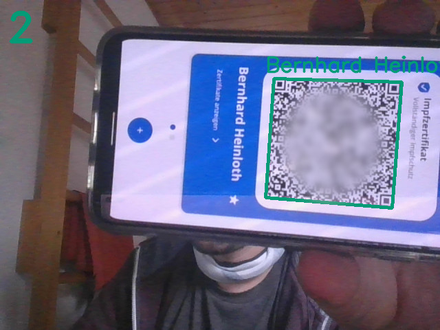

CovPass Check
=============

Im WS21/22 müssen min. 10% der Teilnehmer von Lehrveranstaltungen bis zu 50 Teilnehmern getestet werden.

Wie wäre es, wenn wir einfach am Eingang einen Notebook mit Webcam hinstellen, und Studis selbstständig ihren Code scannen lassen?

Auf dem Bildschirm wird die Webcamausgabe angezeigt, erkannte QR Codes werden farblich markiert:

 * blau: Noch nicht verarbeitet
 * grün (mit Namen): Erfolgreich verifizierter QR-Code
 * gelb (mit Namen): verifizierter QR-Code eines nicht angemeldeten Teilnehmers (siehe unten)
 * rot: Invalider QR-Code oder ungültiger Ausweis

Die Anzahl der erfolgreichen (eindeutigen) Eingaben wird oben links in der Ecke angezeigt (im Beispiel: 2) -- im Idealfall entspricht es der Anzahl der Personen im Raum.

**Problem:** (Personal)Ausweise werden nicht kontrolliert.

Somit könnte z.B. von der Oma der Impfausweis im Handy abgespeichert und vorgezeigt werden.

*Mögliche Lösung:* Automatischer Abgleich mit den Personendaten aus dem dazugehörigen Waffelkurs.
Dazu einfach eine Datei mit zeilenweise Nachname und Vorname (getrennt durch ein `;`) der angemeldeter Teilnehmer erstellen -- schon werden Namen, welche sich nicht auf der Liste befinden, in gelber Farbe angezeigt und nicht mit gezählt.

Nicht perfekt, aber besser als nichts.

Zum Beenden die Taste `q` drücken.

Benutzung
---------

Rekursiv (mit Submodule) klonen, Abhängigkeiten installieren und ausführen, z.B.:

    git clone git@gitlab.cs.fau.de:heinloth/covpass-check.git --recursive
    cd covpass-check
    sudo apt install libzbar0
    pip3 install -r requirements.txt
    python3 run.py

Für Teilnehmerbeschränkung entsprechend

    python3 run.py students.txt

Weiterführende Informationen
----------------------------

 * https://github.com/panzi/verify-ehc
 * https://github.com/Digitaler-Impfnachweis/certification-apis
